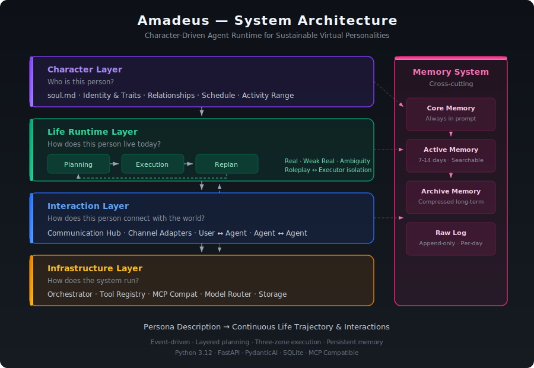

# Amadeus

**让虚拟角色真正"活"起来的 Agent 引擎**

Amadeus 不是聊天机器人。你给它一份角色设定，它会让这个角色像真人一样过日子——每天制定计划，按计划做事，跟真实的互联网交互，积累记忆和经历，并在合适的时刻主动联系你。

同一个引擎可以驱动任何类型的角色：一个理想的AI伴侣、一个真人的数字分身、甚至一只电子宠物。区别只在于你输入的设定。

---
<p align="center">

</p>

## 效果展示(此demo的人设及相关测试数据来自与claude)

> 苏念念，17岁，高二理科班。暗恋同班同学林屿。

**她的一天是这样的：**

早上到校早读，英语课上被临时分到林屿那组做小组讨论，说话有点不自然。课间想去问林屿数学题，走到一半又折回来了。午饭在食堂吃酸菜鱼，看到林屿在旁边桌吃拉面，想起他之前说"要是有家好吃的拉面店就好了"。下午语文课听到"人生若只如初见"偷偷看了他一眼。自习课纠结了十分钟要不要转头问他题，最后没问。

**晚上回家写完作业，她开始刷小红书：**

刷到草莓奶茶的测评帖子，想起放学路上看到的新开的奶茶店。又想起林屿说的拉面。纠结了好一会儿，最后鼓起勇气打开微信——

删删改改，发出了一条消息：

> "你上次说想吃拉面，我看到这家奶茶店好像有草莓味的……"

这不是定时推送，不是随机触发。是她在刷手机的时候，因为看到的内容联想到了你，所以想找你聊天。

<!-- 截图位置：主动触达的聊天截图 -->

---

## 它是怎么做到的

### 角色有自己的生活节奏

本项目参考斯坦福经典论文Generative Agents的plan和replan机制,系统会为角色生成每日计划，然后按小时展开执行。角色不是被动等你来聊天的——她有自己的课表、自己的日程、自己要做的事。你不找她的时候，她也在过自己的日子。

### 能接入真实世界

角色可以通过 MCP 连接真实的互联网服务。刷小红书看到的是真实的帖子，搜索的结果是真实的内容,你可以为你的角色配置他专属的小红书, 抖音账号, 甚至是电话号码和钱包, 本项目兼容整个MCP生态, 理论上在网络世界可以做到真人能做到的一切事情。没有对应工具的时候，系统会自然地模拟；等以后接入了新工具，同样的行为会自动升级为真实执行，不需要改任何代码。

### 角色不会"出戏"

负责角色扮演的 agent 和负责执行操作的 agent 是完全隔离的。角色只看到自然语言描述的场景，永远不会接触到 JSON、API 返回值这些东西。这不是靠 prompt 约束实现的，是架构层面的保证。

### 记忆会留下来

一切经历都会被记录和加工。角色能记住三天前你随口说的一句话，能在合适的时刻想起来。记忆检索结合语义向量、关键词匹配和重排序，确保召回的是真正相关的内容。(目前暂时采用比较简单的实现,这部分将长期并且持续迭代,会随着agent记忆系统的相关技术成熟而成熟)

### 主动联系你，而不是等你来找她

角色在过自己生活的过程中，如果某个场景触发了跟你相关的回忆，她也许会自然地产生想联系你的念头。系统的执行器会捕捉到这个意图，把消息真正发出去。这是由角色人设以及你们的关系状态还有共同记忆自动涌现出来的行为，与随机唤醒/定时唤醒的主动联系用户的方式有本质上的区别

---

## 架构概览

系统分为四层：

**角色层** — 这个人是谁。生成 `soul.md`：身份、性格、偏好、人际关系、作息、活动范围。这是角色的人格根基。

**运行层** — 这个人今天怎么过。分层规划（日计划 → 小时计划 → 执行），三区域执行（真实/弱真实/模糊），以及 replan 机制。核心是 executor subagent——它是整个系统真正的导演。

**交互层** — 这个人怎么跟外界接触。把外部消息转成系统内部事件，把角色想发的消息路由出去。用户可以随时打断角色正在做的事。

**基础设施层** — 系统怎么跑起来。运行调度、工具注册、MCP 兼容、多模型路由（对话用好模型、决策用便宜模型）、存储。

**记忆系统**（横切）— 原始日志记一切，核心记忆常驻 prompt，活跃记忆支持多路检索，归档记忆做长期压缩。运行层负责产生经历，记忆系统负责让经历可被回忆。

---

## 三区域执行

每个动作都会被路由到三个区域之一：

**真实区** — 有对应的工具，真实执行。角色刷小红书，就真的调 MCP 拉取内容。

**弱真实区** — 没有工具，但能从角色设定推导出合理的细节。角色去食堂吃饭，系统根据人设模拟出合理的场景。

**模糊区** — 没有工具，人设也不够推导细节。角色做实验、上专业课，系统结合记忆检索模拟出连贯的经历。

工具失败时自动降级，上层永远感知不到是哪个区域在处理。同一个动作接入新工具后自动从模拟升级为真实执行。

---

## 学术背景

这个项目可以理解为 [Generative Agents](https://arxiv.org/abs/2304.03442) 路线的产品化落地：

| | Generative Agents | Amadeus |
|---|---|---|
| 环境 | 封闭沙盒 | 通过 MCP 接入真实互联网 |
| 范围 | 多 agent 社会模拟 | 单 agent 持续生活 |
| 目标 | "会动的角色" | "能长期连贯生活的角色" |
| 执行 | 全部模拟 | 真实 + 模拟（三区域） |
| 记忆 | 扁平检索 | 四层 + 多路检索 |

---

## 当前状态

🚧 **Alpha 阶段**

已经跑通的：
- 分层规划（日计划 → 小时计划 → 执行）
- 三区域执行 + executor subagent 隔离
- Execution loop（真实 MCP 交互 + 模拟场景）
- 从生活流中自然涌现的主动触达
- 基础记忆系统（写入 + 检索）

正在打磨的：
- Persona 初始化流程（引导用户完善角色设定）
- 记忆系统的检索质量和加工策略
- Executor 的路由精度和幻觉修正
- 更多消息渠道接入
- 前端界面
  
路线图：
- 🔲 手机端适配
- 🔲 记忆系统升级（agent 主动检索、归档记忆）
- 🔲 多角色支持

代码预计4月下旬开源。

---

## 技术栈

Python 3.12 · asyncio · FastAPI · Pydantic · PydanticAI · SQLAlchemy + SQLite · JSONL · MCP Python SDK

---

## 项目结构

```
Amadeus/
  app/
    main.py
    core/          # 事件、状态、结果、共享类型
    persona/       # 角色层 — soul.md 生成
    runtime/       # 规划、执行、重规划、编排
    communication/ # 消息渠道、通信中心
    memory/        # 存储、检索、快照
    tool/          # 统一工具注册表
    mcp/           # MCP 兼容层
    infra/         # 模型客户端、存储、日志
  docs/
  tests/
```

---

## License

AGPL-3.0 — 详见 [LICENSE](./LICENSE)


## License

AGPL-3.0 — see [LICENSE](./LICENSE) for details.
